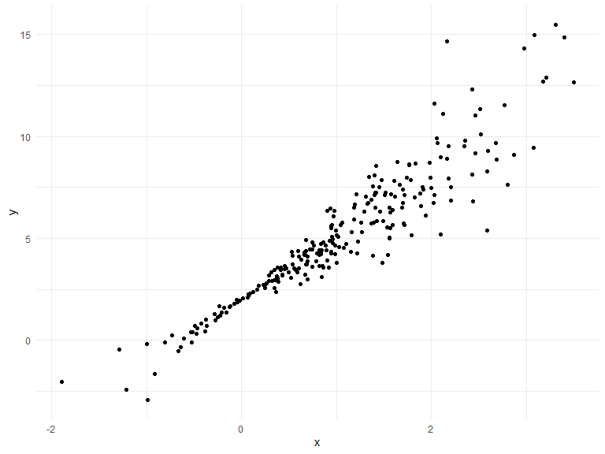
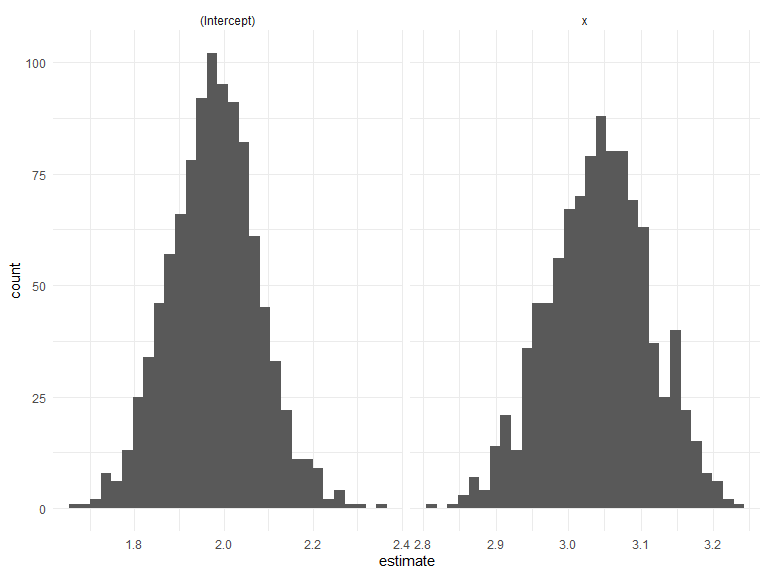
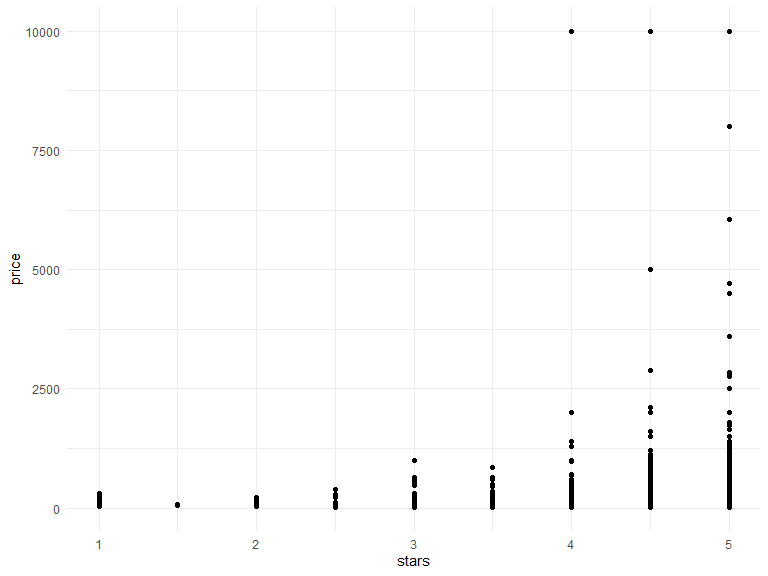
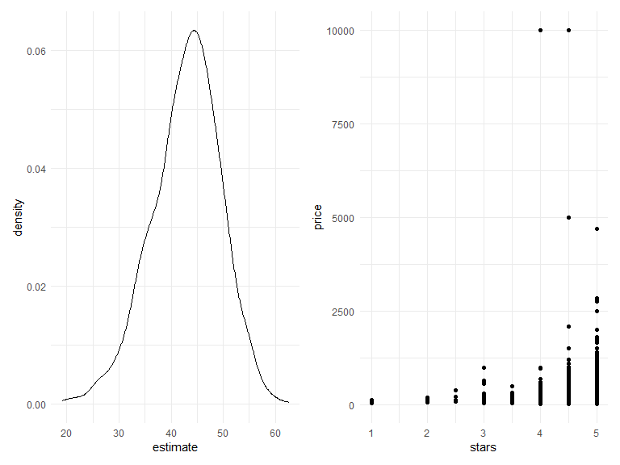

bootstrapping
================
Yu He
11/27/2021

``` r
library(tidyverse)
```

    ## -- Attaching packages --------------------------------------- tidyverse 1.3.1 --

    ## v ggplot2 3.3.5     v purrr   0.3.4
    ## v tibble  3.1.4     v dplyr   1.0.7
    ## v tidyr   1.1.3     v stringr 1.4.0
    ## v readr   2.0.1     v forcats 0.5.1

    ## -- Conflicts ------------------------------------------ tidyverse_conflicts() --
    ## x dplyr::filter() masks stats::filter()
    ## x dplyr::lag()    masks stats::lag()

``` r
library(viridis)
```

    ## Loading required package: viridisLite

``` r
library(modelr)
library(p8105.datasets)
library(patchwork)


knitr::opts_chunk$set(
    echo = TRUE,
    warning = FALSE,
    fig.width = 8, 
  fig.height = 6,
  out.width = "90%"
)
options(
  ggplot2.continuous.colour = "viridis",
  ggplot2.continuous.fill = "viridis"
)
scale_colour_discrete = scale_colour_viridis_d
scale_fill_discrete = scale_fill_viridis_d
theme_set(theme_minimal() + theme(legend.position = "bottom"))
```

## simulate a dataset

``` r
set.seed(1)

n_samp = 250
sim_df_const = 
  tibble(
    x = rnorm(n_samp, 1, 1),
    error = rnorm(n_samp, 0, 1),
    y = 2 + 3 * x + error
  )
sim_df_nonconst = sim_df_const %>% 
  mutate(
  error = error * .75 * x,
  y = 2 + 3 * x + error
)
```

make a plot

``` r
sim_df_nonconst %>% 
  ggplot(aes(x = x, y = y)) + 
  geom_point()
```



``` r
sim_df_nonconst %>% 
  lm(y ~ x, data = .) %>% 
  broom::tidy()
```

    ## # A tibble: 2 x 5
    ##   term        estimate std.error statistic   p.value
    ##   <chr>          <dbl>     <dbl>     <dbl>     <dbl>
    ## 1 (Intercept)     1.93    0.105       18.5 1.88e- 48
    ## 2 x               3.11    0.0747      41.7 5.76e-114

## Let’s try to use the bootstrap for inference

``` r
bootstrap_sample = 
  sim_df_nonconst %>% 
  sample_frac(size = 1, replace = TRUE) %>% 
  arrange(x)

lm(y ~ x, data = bootstrap_sample)
```

    ## 
    ## Call:
    ## lm(formula = y ~ x, data = bootstrap_sample)
    ## 
    ## Coefficients:
    ## (Intercept)            x  
    ##       1.897        3.196

write a function

``` r
boot_sample = function(df){
  sample_frac(df, size = 1, replace = TRUE)
  
}
```

Now, we will make a tibble to keep track of everything

``` r
boot_strap_df = 
  tibble(
    strap_number = 1:1000,
    strap_sample = rerun(1000, boot_sample(sim_df_const))
  )
```

From here, things are kind of the same as “always” - iterate ‘map’

``` r
bootstrap_results =
  boot_strap_df %>% 
  mutate(
    models = map(.x = strap_sample, ~lm(y ~ x, data = .x)),
    results = map(models, broom::tidy)
  ) %>% 
  select(strap_number, results) %>% 
  unnest(results)


bootstrap_results %>% 
  ggplot(aes(x = estimate)) + 
  geom_histogram() + 
  facet_grid(~term, scales = "free")
```

    ## `stat_bin()` using `bins = 30`. Pick better value with `binwidth`.



``` r
lm(y ~ x, data = sim_df_nonconst) %>% 
  broom::tidy()
```

    ## # A tibble: 2 x 5
    ##   term        estimate std.error statistic   p.value
    ##   <chr>          <dbl>     <dbl>     <dbl>     <dbl>
    ## 1 (Intercept)     1.93    0.105       18.5 1.88e- 48
    ## 2 x               3.11    0.0747      41.7 5.76e-114

``` r
bootstrap_results %>% 
  group_by(term) %>% 
  summarize(
    se = sd(estimate)
  )
```

    ## # A tibble: 2 x 2
    ##   term            se
    ##   <chr>        <dbl>
    ## 1 (Intercept) 0.0999
    ## 2 x           0.0705

## use ‘modelr’

``` r
sim_df_nonconst %>% 
  bootstrap(n = 1000, id = "strap_number") %>% 
    mutate(
    models = map(.x = strap, ~lm(y ~ x, data = .x)),
    results = map(models, broom::tidy)
  )
```

    ## # A tibble: 1,000 x 4
    ##    strap                strap_number models results         
    ##    <list>               <chr>        <list> <list>          
    ##  1 <resample [250 x 3]> 0001         <lm>   <tibble [2 x 5]>
    ##  2 <resample [250 x 3]> 0002         <lm>   <tibble [2 x 5]>
    ##  3 <resample [250 x 3]> 0003         <lm>   <tibble [2 x 5]>
    ##  4 <resample [250 x 3]> 0004         <lm>   <tibble [2 x 5]>
    ##  5 <resample [250 x 3]> 0005         <lm>   <tibble [2 x 5]>
    ##  6 <resample [250 x 3]> 0006         <lm>   <tibble [2 x 5]>
    ##  7 <resample [250 x 3]> 0007         <lm>   <tibble [2 x 5]>
    ##  8 <resample [250 x 3]> 0008         <lm>   <tibble [2 x 5]>
    ##  9 <resample [250 x 3]> 0009         <lm>   <tibble [2 x 5]>
    ## 10 <resample [250 x 3]> 0010         <lm>   <tibble [2 x 5]>
    ## # ... with 990 more rows

## Airbnb example

``` r
data("nyc_airbnb")


nyc_airbnb =
  nyc_airbnb %>% 
  mutate(stars = review_scores_location / 2) %>% 
  rename(
    borough = neighbourhood_group
  ) %>% 
  filter(borough != "Staten Island") %>% 
  select(price, stars, borough, room_type)
```

``` r
nyc_airbnb %>% 
  ggplot(aes(x = stars, y = price)) + 
  geom_point()
```



``` r
airbnb_bootstrap_results = 
  nyc_airbnb %>% 
  filter(borough == "Manhattan") %>% 
  bootstrap(n = 1000, id = "strap_number") %>% 
    mutate(
    models = map(.x = strap, ~lm(price ~ stars, data = .x)),
    results = map(models, broom::tidy)
  ) %>% 
  select(strap_number, results) %>% 
  unnest(results)
```

``` r
ggp_star_est = 
  airbnb_bootstrap_results %>% 
  filter(term == "stars") %>% 
  ggplot(aes(estimate)) + 
  geom_density()

ggp_scatter = 
  nyc_airbnb %>% 
  filter(borough == "Manhattan") %>% 
  ggplot(aes(x = stars, y = price)) + 
  geom_point()

ggp_star_est + ggp_scatter 
```


